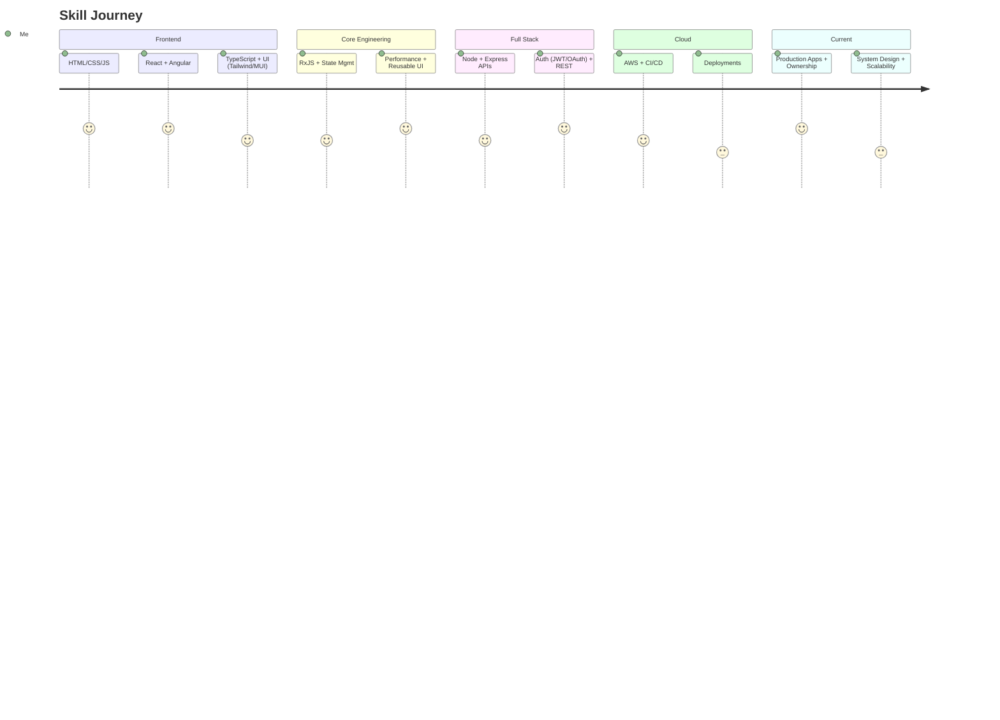

  

<h1 align="center">Ayush Antiwal</h1>
<h3 align="center">(Full Stack Developer)</h3>

_Hi everyone! I'm Ayush Antiwal, and I'm currently working as a Frontend Developer at Lattice Innovations. It's been a little over three years since I started my professional journey, but honestly, it feels like yesterday I was sitting where you are now—trying to figure out where to start and how to stand out._

_I work primarily with Angular, React, TypeScript, and Node.js, building products that are used by real users every day. Before this, I worked at Nagarro, where I got exposure to cloud technologies, microservices, and large-scale software development. Along the way, I also earned my AWS Cloud Practitioner certification because I believe learning shouldn't stop after college._

#### What I Believe

_Good software is not just about writing code—it's about solving the right problem, keeping things maintainable, and delivering value consistently.
I like working on products from idea to deployment, improving both user experience and engineering quality along the way._

_I care about how different parts of an application work how data moves through it how APIs are made and how databases support systems that are reliable and easy to maintain._

One thing I’ve learned over my experience is that your degree opens doors, but curiosity and consistency build your career.

_I enjoy combining solid engineering with thoughtful product design to create software that feels simple for users and powerful behind the scenes._

  

  

-------------------------------------------------------

  
 <strong align="center" color="blue">Build things that matter. Keep them simple.

