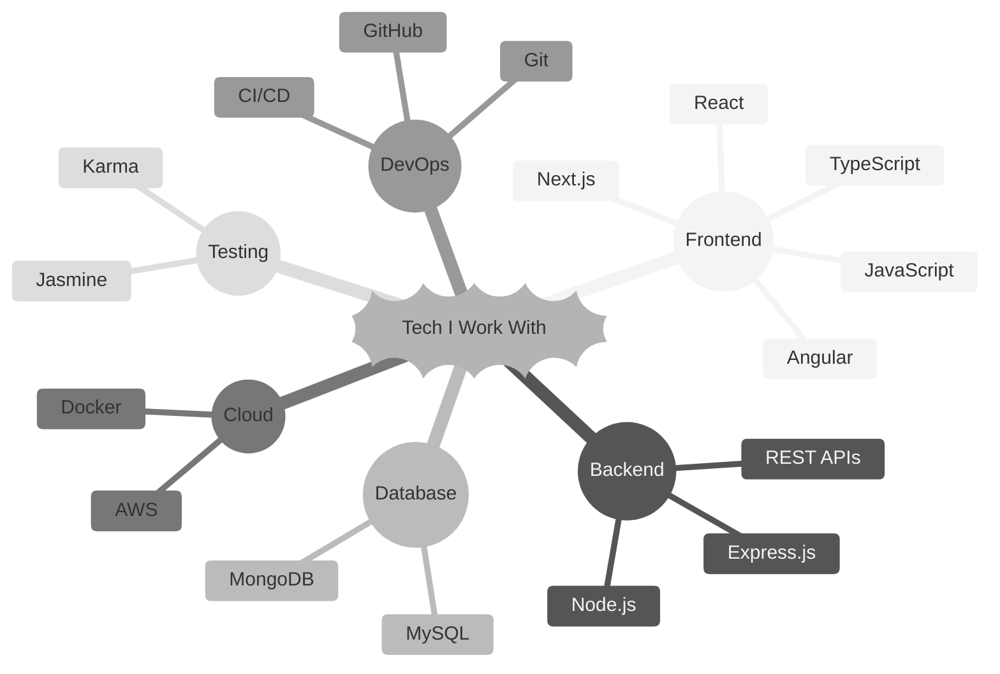

  

<h1 align="center"> Ayush Antiwal (Full Stack Developer) </h1>

I really like building products that are easy to use, fast and work well from the very start to the end. My work is based on the idea that good software should do more than work. It should make things easier connect the parts that users see and the parts that they do not see smoothly and make complicated tasks feel simple.

I have a lot of experience, with Angular, React, Node.js, Express and modern JavaScript. I use this experience to build web applications that work well on devices and backend services that are well organized work efficiently and pay attention to small details.

I care about how different parts of an application work how data moves through it how APIs are made and how databases support systems that are reliable and easy to maintain.

I also think that using patterns that can be reused writing code that can be tested and working well with others are important. This helps me work effectively in teams and adapt quickly to changing needs of a product.

Whether I am making features improving existing systems, connecting APIs or solving complicated problems I focus on finding solutions that are practical work well and meet business goals.

I like working on products where design, engineering and what users need all come together. I take pride in building things that work well now. Can grow in the future.

I am always looking to learn ways of building improving and delivering digital products that create value that lasts.

#### What I Believe

Good software is not just about writing code—it's about solving the right problem, keeping things maintainable, and delivering value consistently.
I like working on products from idea to deployment, improving both user experience and engineering quality along the way.

### Current Focus
* Building scalable full-stack applications that are clean, reliable, and ready to evolve with business growth.
*  Crafting frontend experiences with strong architecture, smooth performance, and a focus on usability.
* Working with cloud-native systems that are secure, efficient, and designed for modern deployment.
* Exploring AI-powered features that make digital products smarter, more personalized, and more helpful.

I enjoy combining solid engineering with thoughtful product design to create software that feels simple for users and powerful behind the scenes.

> [!TIP]
> Build things that matter. Keep them simple.

